<div align="center">

# 🎨 Blender Asset Management

### Professional Asset Publishing & Texture Tools — **100% FREE**

*Streamline your workflow with intelligent validation, texture optimization, and automatic versioning*

[](https://www.blender.org/)
[](https://www.python.org/)
[](LICENSE)
[](https://github.com/alfajririzqi/asset_management/releases)
[](https://github.com/alfajririzqi/asset_management)

[✨ Features](#-features) • [📥 Installation](#-installation) • [🚀 Quick Start](#-quick-start) • [📚 Documentation](#-documentation) • [💬 Support](#-support)

---

</div>

## 🌟 Why Asset Management?

Stop wasting time on manual asset publishing and texture cleanup. This addon automates your entire production workflow:

- ✅ **Prevent Mistakes**: Pre-publish validation catches errors before delivery
- ✅ **Save Time**: One-click publishing with automatic versioning
- ✅ **Optimize Assets**: Smart texture consolidation reduces file sizes
- ✅ **Stay Organized**: Clean folder structure and version tracking
- ✅ **Work Safely**: Published file protection prevents accidental edits

**Perfect for:** Freelancers, Asset Creators, Hobbyists, Small Studios

**Blender Asset Management** is a comprehensive addon designed for production environments, offering automated validation, smart texture handling, and foolproof version control. Perfect for studios, freelancers, and technical artists who demand reliability.

### Why This Addon?

- ✅ **Zero-Config Publishing** - Pre-validation catches issues before delivery
- 🔒 **Published File Protection** - Prevents accidental edits to released assets
- 🎯 **Smart Analysis** - Deep scene scanning with detailed reports
- 🚀 **Transform Safety** - Intelligent modifier handling with auto-backup
- 📦 **Clean Delivery** - No metadata clutter in published folders

---

<table>
<tr>
<td width="50%">

### 🚀 Publishing System
- ✓ Pre-publish validation with detailed reports
- ✓ Force Publish mode for controlled bypasses  
- ✓ Automatic versioning (`v001`, `v002`...)
- ✓ Clean delivery - single centralized log
- ✓ Published file protection (3-layer detection)

### 📊 Scene Analysis
- ✓ Deep multi-threaded scanning
- ✓ Material Usage & Texture Paths reports
- ✓ Auto-switch to Scripting workspace
- ✓ Modal progress bar (0-100%)

</td>
<td width="50%">

### 🎨 Texture Optimization
- ✓ Batch resolution control (downgrade/restore)
- ✓ Format conversion (PNG ↔ JPEG)
- ✓ Consolidate duplicates
- ✓ Auto-correct texture mapping
- ✓ Cleanup unused textures

### 🛡️ Transform Safety
- ✓ Auto-workflow with modifier detection
- ✓ ARMATURE protection (rigged objects safe)
- ✓ Automatic backup to `.temp` collection
- ✓ Sequential: Backup → Apply Mods → Transform

</td>
</tr>
</table>

<details>
<summary><b>📦 Additional Features</b></summary>

- **Version Control**: Create/restore numbered versions with descriptions
- **File Cleanup**: Clear orphan data, optimize materials
- **Batch Operations**: Rename textures with patterns
- **High Poly Analysis**: Detect heavy meshes with configurable thresholds
- **Transform Analysis**: Find objects with non-default transforms

</details>

---

## � Installation

### Prerequisites

| Requirement | Version | Notes |
|-------------|---------|-------|
| **Blender** | 4.0+ | Tested on 4.0 - 4.5.1 |
| **Python** | 3.10+ | Bundled with Blender |
| **OS** | Any | Windows, macOS, Linux |

### Quick Install

1. **Download** the latest release from [Releases](../../releases) page
2. **Open Blender** → `Edit` → `Preferences` → `Add-ons`
3. **Click** `Install...` → Select downloaded ZIP file
4. **Enable** checkbox next to "Asset Management"
5. **Access** from `N-panel` → `Asset Management` tab

<details>
<summary><b>🔧 Alternative: Git Clone (for developers)</b></summary>

```bash
# Navigate to Blender addons directory
cd %APPDATA%\Blender Foundation\Blender\4.0\scripts\addons  # Windows
cd ~/Library/Application Support/Blender/4.0/scripts/addons # macOS

# Clone repository
git clone https://github.com/YOUR_USERNAME/blender-asset-management.git asset_management

# Restart Blender and enable addon
```

</details>

---

## � Quick Start

### 1️⃣ First-Time Setup

Open `N-panel` → **Asset Management** tab, then:

```
📂 Set Publish Path
   └─ Publishing Panel → "Publish Path" → Choose output directory

📁 Organize Asset Structure
   Chair/
   ├── Chair.blend
   └── textures/          ← Important: textures must be in this folder
       ├── BaseColor.png
       ├── Normal.png
       └── ...
```

### 2️⃣ Publishing Workflow



```mermaid
graph LR
    A[Check Readiness] --> B{Validation}
    B -->|Pass ✓| C[Choose Mode]
    C -->|Overwrite| D[Publish]
    C -->|Versioning| E[Publish]
    B -->|Warnings âš | F[Force Publish]
    B -->|Errors ✗| G[Fix Issues]
    G --> A
    D --> H[Published ✓]
    E --> H
    F --> H
```

**Steps:**

1. **Validate** → Click `Check Publish Readiness`
2. **Review** → Check validation results
   - 🟢 Green = Ready
   - 🔴 Red Warning = Force-able
   - 🔴 Red Error = Must fix
3. **Choose Mode**:
   - **Overwrite**: Always replaces existing file (for updates)
   - **Versioning**: Creates incremental versions (v001, v002...)
4. **Publish** → Click `Publish Asset` (or enable `Force Publish`)

**Output Examples:**

**Overwrite Mode:**
```
PublishPath/
└── Chair/
    ├── Chair.blend         ← Always updated (same filename)
    └── textures/
        ├── BaseColor.png
        └── Normal.png
```

**Versioning Mode:**
```
PublishPath/
└── Chair/
    ├── Chair_v001.blend    ← Version 1
    ├── Chair_v002.blend    ← Version 2
    ├── Chair_v003.blend    ← Latest version
    └── textures/           ← Shared textures folder
        ├── BaseColor.png
        └── Normal.png
```

> **Note:** Textures are always in a shared `textures/` folder, not versioned separately. Only `.blend` files are versioned.

### 3️⃣ Scene Analysis

**Deep Scan Your Project:**

1. Click `Analyze Scene Deeply` (High Poly panel)
2. Watch progress bar (multi-threaded)
3. Review **Dialog Popup**:
   - 📄 Material Usage Report preview
   - 📄 Texture Paths Report preview
4. Click `Switch to Scripting Workspace`
5. Full reports loaded in Text Editor

**Use Cases:**
- 🔍 Audit texture usage before publish
- 📊 Find linked library dependencies  
- 🧹 Identify missing/external files

### 4️⃣ Versioning Modes Explained

| Mode | Behavior | Use Case |
|------|----------|----------|
| **Overwrite** | Always replaces `Chair.blend` | Quick updates, work-in-progress |
| **Versioning** | Creates `Chair_v001.blend`, `v002`, etc. | Milestone tracking, client deliveries |

**When to use Overwrite:**
- Daily updates to published assets
- Work-in-progress iterations
- Single "latest" version needed

**When to use Versioning:**
- Client deliveries (keep history)
- Milestone tracking
- Need rollback capability

---

## 🛡️ Safety Features

### Published File Protection

**The addon prevents editing published assets:**

```
⚠️ Published File Detected
   Source: D:/Projects/MyAsset/MyAsset.blend
   
   [All operators disabled]  ← Prevents recursive versioning
```

- 3-layer detection (folder pattern, log parsing, parent fallback)
- Inline warnings in all panels
- Total operator blocking
- Source file reference for context

### Smart Validation

| Check Type | Behavior |
|------------|----------|
| 🔴 **Critical Errors** | Must fix (file not saved, no publish path) |
| 🟡 **Warnings** | Force-able (missing textures, orphan data, etc.) |
| ✅ **Validation Required** | Auto-reset on file load |

**Force Publish** bypasses warnings but **never** critical errors.

---

## 📂 Architecture

<details>
<summary><b>🏗️ Project Structure</b></summary>

```
asset_management/
├── 📄 __init__.py                      # Addon registration
│
├── 📁 operators/                       # Business logic (18 operators)
│   ├── publish.py                     # Main publish with logging
│   ├── check_publish.py               # Pre-publish validation
│   ├── check_scene.py                 # Deep scene analysis
│   ├── check_transform.py             # Transform safety
│   ├── versioning.py                  # Version management
│   └── optimize_*.py                  # Texture optimization
│
├── 📁 panels/                          # UI components (5 panels)
│   ├── main_panel.py                  # Root panel
│   ├── publish_panel.py               # Publishing UI
│   ├── versioning_panel.py            # Version control UI
│   ├── file_management_panel.py       # Texture operations UI
│   └── batch_rename_panel.py          # Batch rename UI
│
├── 📁 utils/                           # Shared utilities
│   └── published_file_detector.py     # Multi-layer detection
│
├── 📁 docs/                            # Documentation
│   ├── architecture/                  # System design
│   ├── development/                   # Implementation notes
│   └── guides/                        # User tutorials
│
└── 📁 .github/
    └── copilot-instructions.md        # Architecture guide
```

**Design Principles:**
- ✅ Modular separation (operators/panels/utils)
- ✅ Circular import prevention (shared code in `utils/`)
- ✅ Scene property-based state management
- ✅ App handlers for auto-reset on file load

</details>


---

## 📚 Documentation

| Resource | Description |
|----------|-------------|
| **[CHANGELOG.md](CHANGELOG.md)** | Version history and updates |
| **[docs/](docs/)** | Comprehensive documentation |


### For Users
- 📖 [Testing Checklist](docs/guides/TESTING_CHECKLIST.md)
- 🛡️ [Transform Safety Guide](docs/guides/TRANSFORM_SAFETY_IMPLEMENTATION.md)

### For Developers
- 🏗️ [Publish System Design](docs/architecture/PUBLISH_SYSTEM_V2.md)
- 🔧 [Implementation Summary](docs/development/IMPLEMENTATION_SUMMARY.md)

---

## 🐛 Troubleshooting

<details>
<summary><b>Common Issues & Solutions</b></summary>

### Panels Not Showing
```
Problem: N-panel empty or "Asset Management" tab missing
Solution: Press F3 → Type "Reload Scripts" → Enter
```

### Validation Results Don't Reset
```
Problem: Old validation results persist after opening new file
Solution: Validation auto-resets on file load. If stuck, re-run "Check Publish Readiness"
```

### Published File Not Detected
```
Problem: Editing published file but no warning appears
Solutions:
  1. Check folder matches pattern: AssetName_v001, AssetName_v002, etc.
  2. Verify .publish_activity.log exists in publish root directory
  3. Reload file to clear detection cache
```

### Force Publish Still Blocked
```
Problem: Force Publish enabled but button still disabled
Reason: Only 2 absolute blocks exist (no bypasses):
  - File not saved → Save your .blend file
  - No publish path set → Set path in Publishing panel

All other checks are warnings that Force Publish bypasses.
```

### Script Errors After Update
```
Problem: Errors in console after updating addon
Solution: 
  1. Disable addon in Preferences
  2. Restart Blender
  3. Re-enable addon
```

Still stuck? [Open an issue](../../issues) with your Blender version and error log.

</details>

---

## 🤝 Contributing

Found a bug or have a feature request? **[Open an issue](../../issues)**!

Pull requests are welcome. For major changes, please open an issue first to discuss what you would like to change.

### Reporting Issues

Please include:
- Blender version
- Steps to reproduce
- Expected vs actual behavior
- Screenshots/error logs (if applicable)

### Development

For architecture details and coding guidelines, see:
- **[.github/copilot-instructions.md](.github/copilot-instructions.md)** - Architecture guide
- **[docs/](docs/)** - Technical documentation

---

## 📄 License

This project is licensed under the **GNU General Public License v3.0** - see [LICENSE](LICENSE) file for details.

### Summary
- ✅ Free to use, modify, and distribute
- ✅ Source code must remain open
- ✅ Changes must be documented
- ℹ️ No warranty provided

---

## � Support

### 🐛 Found a Bug?
[Open an issue](https://github.com/alfajririzqi/asset_management/issues) with:
- Blender version
- Steps to reproduce
- Expected vs actual behavior

### 💡 Feature Requests
Share your ideas on [GitHub Discussions](https://github.com/alfajririzqi/asset_management/discussions)

### ⭐ Show Your Support
If this addon saves you time:
- ⭐ **Star this repo** on GitHub
- 📢 **Share** with fellow Blender artists
- 💬 **Leave feedback** on [Blender Artists Forum](https://blenderartists.org/)

### ☕ Support Development
This addon is **100% free** and always will be. If you'd like to support development:
- 💙 [Buy me a coffee](https://ko-fi.com/yourusername) *(optional link)*
- 🎓 Share tutorials/workflows using this addon
- 🤝 Contribute code or documentation

---

## 🗺️ Roadmap

### v1.0 (Current) ✅
- Complete publishing system
- Texture optimization tools
- Version control
- Published file protection

### v2.0 (Planned - Free Updates)
- Batch publishing
- Enhanced texture analytics
- Material library manager
- Performance improvements

### Future (Pro Version - Optional)
- Team collaboration features
- Pipeline integration (USD, FBX)
- Asset health dashboard
- Analytics & reporting

*Pro version will be an optional upgrade for advanced features. All v1.0 features remain free forever.*

---

## 🙏 Acknowledgments

- Built with ❤️ for the Blender community
- Inspired by real production pipeline workflows
- Thank you to all contributors and testers!

---

<div align="center">

**Free Forever • No Ads • No Watermarks**

Made by [Rizqi Alfajri](https://github.com/alfajririzqi) for Blender Artists Worldwide


⭐ **Star this repo** if it helps your workflow!

[Report Bug](../../issues) • [Request Feature](../../issues) • [Documentation](docs/)

---

**Version 2.0.0** • Last Updated: November 4, 2025 • Blender 4.0+

</div>
